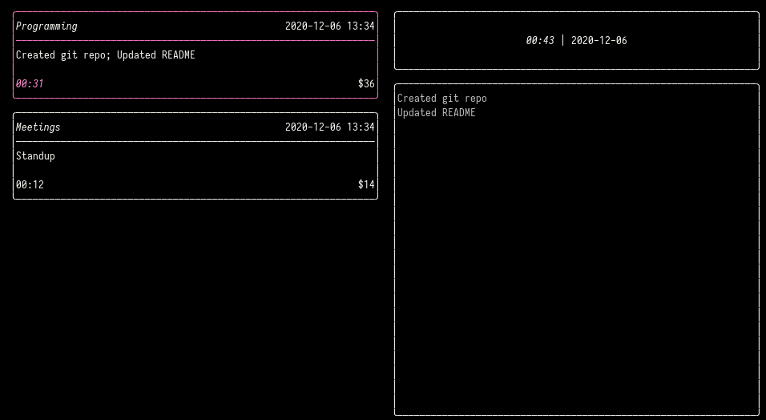

# ttyme

A TUI for [Harvest](https://www.getharvest.com/).



## Usage

Press...

 - `q` to quit
 - `r` to force a refresh
 - `a` to create a new time entry
 - `e` to edit a time entry
 - `Esc` to save edits
 - `k` to focus next entry
 - `j` to focus previous entry
 - `p` to pause a time entry
 - `dd` to delete a time entry
 - `-?[0-9]+[hm]` to update the time: `-1h` removes one hour, `23m` adds 23 minutes
 - `t` to cycle between tasks on a time entry
 - `l` to go to next day
 - `h` to go to previous day
 - `L` to go to next week
 - `H` to go to previous week
 - `n` to go to today

## Install

Install [stack](https://docs.haskellstack.org/en/stable/README/) and run `make install`.

You'll then have to create a configuration file `~/.config/ttyme/ttyme.toml`:

```toml
harvest_token = "TOKEN"
harvest_account = "ACCOUNT ID"
project_id = "PROJECT ID"
```

Go to the [developers](https://id.getharvest.com/developers) page on Harvest to get the `TOKEN` and `ACCOUNT ID`. `PROJECT ID` can be found by navigating to a project page from [Projects](https://julienmaisonneuve.harvestapp.com/projects) and looking at the URL for the project.
